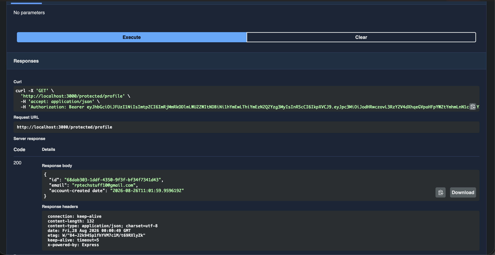

# Supabase Auth API

A secure Express API using **Supabase Auth** as the identity provider — sign up, log in, log out, and protected routes guarded by JWT verification. Supabase handles password hashing and token signing; this API's job is to send credentials to Supabase and verify the tokens it hands back.

## How to run

```bash
npm install
cp .env.example .env
```

Fill in `.env` with your own Supabase project's URL and anon key (see below), then:

```bash
node server.js
```

The server starts on `http://localhost:3000`. Interactive docs (with bearer auth) are available at `http://localhost:3000/docs`.

## Environment variables

See `.env.example`:

```
SUPABASE_URL=your_supabase_project_url
SUPABASE_KEY=your_supabase_anon_key
PORT=3000
```

Get these from your own Supabase project: **Project Settings → API** (use the `anon` `public` key — never the `service_role` key).

## Endpoints

| Method | Path                  | Auth required? | Description                          |
|--------|-----------------------|-----------------|----------------------------------------|
| POST   | `/auth/signup`        | No              | Create a new user account             |
| POST   | `/auth/login`         | No              | Log in, returns access + refresh token |
| POST   | `/auth/logout`        | Yes (Bearer)    | End the user's session                 |
| GET    | `/public/info`        | No              | Public, open data                      |
| GET    | `/protected/profile`  | Yes (Bearer)    | Read the logged-in user's profile      |

### Status codes used

- `200` — successful login/read
- `201` — user created (signup)
- `204` — logout success (no content)
- `400` — missing/invalid input
- `401` — missing, malformed, invalid, or expired token

## Auth flow

1. Client sends `email`/`password` to `POST /auth/signup` or `POST /auth/login`.
2. Supabase validates the credentials and returns a JWT (`access_token`).
3. The client attaches that token on protected requests: `Authorization: Bearer <token>`.
4. The server verifies the token with Supabase (`supabase.auth.getUser(token)`) before allowing access.

Token verification is implemented once as reusable Express middleware (`requireAuth`) and applied to every protected route — `GET /protected/profile` and `POST /auth/logout` both use it, with no duplicated auth logic.

## Swagger UI

`/docs` shows a lock icon on protected routes. Click **Authorize**, paste an access token from `/auth/login`, and "Try it out" works end-to-end from the browser.



## Notes

- Supabase handles all password hashing and token signing — this project never implements cryptography itself.
- `.env` holds real secrets and is git-ignored; `.env.example` is committed with placeholder values.
- The `service_role` key is never used anywhere in this project — only the `anon` public key.